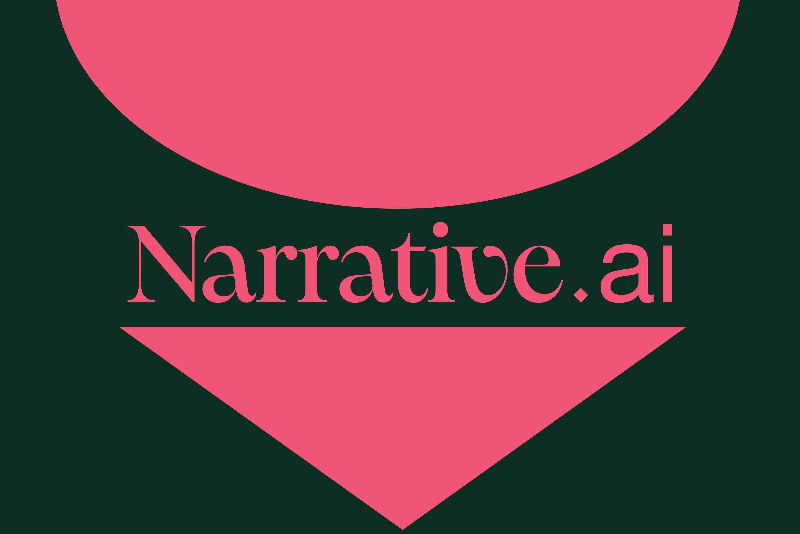

# Narrative.ai

[Devpost](https://devpost.com/software/narrative-ai)

## Inspiration

Struck by the affective power of 2000s-era visual novels (ノベルゲーム), forged at the now-global intersection between the abject alienation at the heart of the individual subject and the novel totality of closely-knit social relations that constitute the subject as such—hence, moe—we set out to build a new take—but with a taste of the familiar—on the formal unity of the visual novel genre. Eliezer Yudkowsky remarks somewhere that ours is, so to speak, the world-historic era of AI-alignment. For him, one divides into two: a road diverges into an either/or, between our self-destruction and descent into the dystopia of Roko and Ginsberg's terrible Moloch or the messianic reclamation of ourselves. We cannot disavow the creative destruction of the unspeakable void that reproduces us but instead must—together—work through the malaise of alienation as such. This collective VN project comes as a kind of a preliminary answer to this animating problematic of our time.

## What it does

Narrative.ai is a collaborative story-crafting web-game powered by Convex, Together.ai, and React. Players contribute to the narrativic process by penning their own ideas for how the ongoing narrative may proceed, and when prompted, Narrative.ai processes the players' collaborative outline and generates the next chapter in the narrative, from where players are re-immersed into the collective, practical activity of storytelling. In this way, Narrative.ai mirrors the ancient storytelling traditions of the Homeric epics and their process of coming-into-being, re-casting and re-articulating them in a novel light.

## How we built it

Narrative.ai is powered by Convex, Together.ai, and React.

## Challenges we ran into

We worked with new and unfamiliar languages, APIs, and frameworks—all an opportunity to learn and gain practical experience from tinkering, as well as mentorship from sponsors and organizers.
One of our teammates fell ill and dropped out! We shrank from three to a duo, and were forced towards a regime of relative austerity on our productive capacity. We worked through three separate ideas, until settling on the visual novel form not too long from the deadline!
Sleep deprivation.
Accomplishments that we're proud of

We are proud of having ironed out a working project, built from previously unfamiliar components, that is delightful to play with. We understand that old adage, that there is no royal road to science...

## What we learned

We learned the basics of Convex and how to use it for backend development.
We learned how to use Together.ai's LLM models and how to integrate it into a full-stack web development project.

## What's next for Narrative.ai

We hope to add more new features to the visual storytelling aspect of Narrative.ai, as well as introducing new ludic features such as a system of competition—such as points-keeping, based on uniqueness of prompt.

### Credits
- convex-hacks-pack repo for starting off our hack
